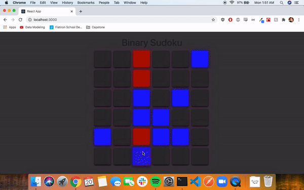

# Binary Sudoku

A colorful and aesthetic version of the game of binary sudoku, itself based on the famous original game. Unlike regular Sudoku, Binary Sudoku has only 1s and 0s, or in this case, reds and blues.

To solve the puzzle, the gameboard must end up with half of its squares red and the other half blue. Each row or column must also have equal number of reds and blues, and no two rows or columns can be the same. Furthermore, triples are not allowed (no three consecutive reds/blues).

As the user gets closer to solving the puzzle, the reds and blues will meld and turn the gameboard more and more purple!

## Technologies Used

Frontend: React, Javascript, React Bootstrap

Backend: Ruby on rails (currently skeletal)

## Features

Bootstrap's "Container" component allows a easy-to-manipulate grid for the Binary Sudoku gameboard.

Simple but attractive visual cues show the player which game squares are filled-in from the start (the first pieces of the puzzle) and how close the player is to winning the game.

App takes full advantage of React - running the game check and re-rendering with every move the user makes is a perfect example of React's strengths.

## Challenges

This was my first ever React app, so learning how all the components tied together via changes of state and properties was certainly a challenge. With how many instances of a just few components are occurring at once in a given game, organizing it all was certainly a headache.

Once I figured out how each component interacted with one another, things became much easier. After that I felt like I could rely on my Javascript skills to produce the logic that checked the game with each render.

## Future Modifications

Full online deployment, including a secure backend that contains users and secure passwords.

Robust code that generates puzzles rather than randomly selecting a puzzle from a pre-programmed list.

Introduction of high scores (based on time spent and board difficulty), and high scores adjusted for difficulty and board size.

 
